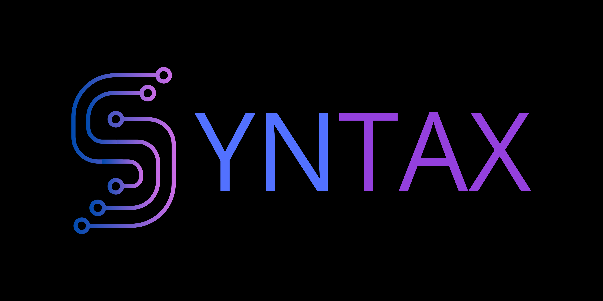

# 📌 Syntax Scrum Team

> Equipe formada por alunos de Desenvolvimento de Software Multiplataforma para realização de Projetos de Aprendizagem Integrada (APIs) pela FATEC São José dos Campos.

# 🗂️ Projetos

| 📅 Semestre  | 📂 Nome do Projeto  | 🏢 Cliente         | 📝 Descrição                                      |
|--------------|----------------------|--------------------|----------------------------------------------------|
| 2º SEM 2025  | [SideQuest](https://github.com/Syntax-Fatec-SJC/SideQuest) | GSW | Sistema de Gerenciamento de Tarefas. |

# 👨‍💻 Equipe de Desenvolvimento

| Foto                                                                          | Nome              | GitHub                                         | LinkedIn                                                              |
|-------------------------------------------------------------------------------|-------------------|------------------------------------------------|-----------------------------------------------------------------------|
|   | Lucas Araujo      |    |         |
|      | Gabriel Robert    |       |       |
|  | Tatiane Olivera   |   |     |
|       | João Silva        |        |  |
|  width=50px> | Francisco Rafael  |  |  |
|    | Carlos Intrieri   |             |                             |
